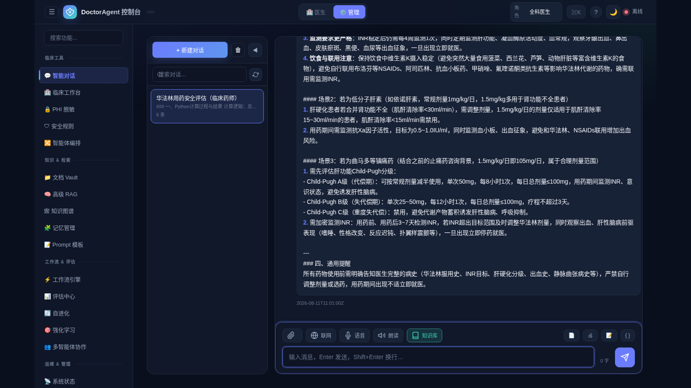

# DoctorAgent

[English](README.md) | [中文](README.zh.md) | [日本語](README.ja.md)

[](https://github.com/weed33834/DoctorAgent)
[](https://www.python.org/downloads/)
[](LICENSE)
[](https://docs.astral.sh/ruff/)
[](https://hl7.org/fhir/R4/)

**コンプライアンス優先・オンプレミス・監査可能な臨床AIエージェント。** 企業の信頼境界内で臨床意思決定支援および文書エージェントを展開するためのローカルファースト・フレームワーク — 暗号化ストレージ、改ざん検知可能な監査ログ、RBAC + OIDC SSO、KMS、PHI マスキング、決定論的安全ルール、LLM 出力ガードレール。明示的な承認なしに PHI がホストから外部に出ることはありません。臨床能力の詳細は [docs/CLINICAL_CAPABILITIES.md](docs/CLINICAL_CAPABILITIES.md) を参照してください。

---

## できること

DoctorAgent は一つの強化コア上に二つの協調面を提供します：

1. **臨床AIエージェント**（`doctoragent.clinical`）— FHIR R4 アダプタ、決定論的臨床ルールエンジン（バイタルサイン / 検査 / 薬物相互作用 / アレルギー交差反応 / 重複投薬）、LLM 出力ガードレール（引用検証 / 禁止コンテンツ / PHI 漏洩 / プロンプトインジェクション）、15 の臨床ツール、およびマルチエージェントワークフロー（専門エージェントへファンアウト：病歴、薬物安全、文献、文書、その後ガードレール・引用・免責事項付きの結果に統合）。
2. **暗号化ドキュメントボールト**（DoctorAgent コア）— 監視ディレクトリに投入されたファイルは分類され、AES-256-GCM で暗号化、インデックス化（SQLite + FTS5）され、ローカルにアーカイブされます。取得は自然言語検索とツール呼び出しエージェントです。

臨床ワークフローのエントリポイント：

```python
from doctoragent.clinical.agents import run_clinical_workflow
result = await run_clinical_workflow(
    patient_context={"patient_id": "synthetic-001", "medications": [...], ...},
    query="この患者の投薬は安全ですか？",
    llm_provider=your_local_ollama_provider,  # None = 決定論的ルールのみ、安全なデフォルト
)
```

ドキュメント取得：

```bash
doctoragent ask "去年的房租合同在哪"
doctoragent agent "把所有财务相关的文件整理一下"
```

クラウド接続はデフォルトで無効です。運用者が明示的に許可しない限り、データがマシンから外部へ送出されることはありません。

> ⚠️ 本システムは臨床意思決定支援ツール（CDS）であり、医師の診断を代替するものではありません。最終的な判断は医師が行います。

---

## デモ（プロモーション）



**実モデルのプロモーション動画**（step-3.5-flash による実多ターン臨床対話＋全モジュール巡回、編集済み）：
[▶ `assets/demo/doctoragent_demo_edit.mp4` を再生](assets/demo/doctoragent_demo_edit.mp4)
- 完全版ウォークスルー：`assets/demo/doctoragent_live_demo.mp4`
- 全モジュールのスクリーンショット：`assets/demo/final/`
- 実際の会話内容：`assets/demo/final/real_chat_content.json`

---

## 機能（Features）

完全で本番利用可能なエージェントプラットフォーム — **会話からほぼすべてを実行できます**：

- **会話駆動オペレーション**：会話内で診療科の切替、ナレッジベースの作成・インポート、ドキュメント取込、システム状態の確認、プロンプト変更・専門家/スキルの追加（管理UIと同一ストアを共有）
- **汎用エージェントツール**：Web 検索、Web フェッチ、現在時刻、安全な数学計算(simpleeval)、サンドボックスで Python 実行＋チャート出力
- **サーバー側会話**：永続化、全体検索、分岐、いいね/低評価、共有リンク（公開閲覧＋失効）、自動タイトル、要約
- **診療科ロール**：18 の組み込み医師ペルソナ（循環器/外科/麻酔/救急/ICU/小児/…）— 専門プロンプト、レッドフラグ、デフォルトツール、コンソールで切替可能
- **組み込み医学知識ベース**：12 の必須ドキュメント（危急値/薬物相互作用/基準値/急性症候群…）を起動時に自動シード、PDF 追加のためのカタログ＋アップロードガイド付き
- **メモリ**：短期/エピソード/意味/手続き + 統合・圧縮・忘却
- **RAG ナレッジベース**：PDF/DOCX/XLSX/MD 取込、ハイブリッド検索、引用追跡
- **マルチエージェント＆ツール**：ReAct ループ、コードサンドボックス、ブラウザ自動化、グループチャット/ディベート、MCP クライアント+サーバー、A2A プロトコル
- **プラットフォーム**：RBAC+OIDC+MFA(TOTP)、マルチテナント組織、監査チェーン、AI セキュリティ・レッドチーム、相互運用、災害復旧、コスト/請求、可観測性、エラーコード体系

詳細：`docs/KNOWLEDGE_CATALOG.md`、`docs/KNOWLEDGE_UPLOAD_GUIDE.md`。

---

## クイックスタート

```bash
# インストール（Python 3.10+ が必要）
pip install doctoragent[gui,server]

# ローカルモデルを起動（Ollama が最も簡単）
ollama pull qwen3:8b
ollama serve

# DoctorAgent を起動し、~/DoctorAgent/Inbox にファイルを投入
doctoragent daemon
```

初回実行時にディレクトリ構成が自動作成されます。Inbox に置かれたファイルは分類・暗号化・アーカイブされます。

---

## 主な機能

**臨床AIエージェント**（`doctoragent.clinical`）
- FHIR R4 アダプタ（HL7 公式 `fhir.resources`、SMART-on-FHIR bearer 認証）
- CDS Hooks 2.0 サービス（patient-view / order-select / order-sign）
- ナレッジソース：openFDA、RxNorm、PubMed（専用DBなし）
- 決定論的安全ルール：バイタルサイン / 検査 / 薬物相互作用 / アレルギー交差反応 / 重複投薬
- LLM 出力ガードレール：引用 / 禁止コンテンツ / PHI 漏洩 / プロンプトインジェクション（最も厳しい措置を採用）
- 15 の臨床ツール、五段階の副作用アノテーション（読み取り / 安全な書き込み / 破壊的書き込みはヒューマンインザループ）
- 4 つの専門エージェント + `ClinicalOrchestrator`（ファンアウト / ファンイン + 決定論的安全 + ガードレールレビュー）
- HIPAA Safe Harbor PHI マスキングパイプライン（10 コア臨床識別子カテゴリ）
- コンプライアンス自己チェックレポート（監査証拠としてエクスポート可能）
- 22 のゴールデンケース評価スイート（プロンプトインジェクション、PII 抽出、権限昇格などの敵対的サンプルを含む）
- 臨床QAベンチマークフレームワーク（MedQA / PubMedQA）：精度 / macro-F1 / キャリブレーション（ECE+Brier）/ 安全性 / 引用 / レイテンシ、クロスファミリー LLM-as-judge
- 6 セットの合成 FHIR R4 テストデータ、オフラインデモ対応

**ファイル管理**
- Inbox ディレクトリをリアルタイムで監視し、新規ファイルを自動処理
- AES-256-GCM による暗号化保存、アトミック書き込み
- 三階層の鍵体系（マスター鍵 → Vault 鍵 → ファイル鍵）
- SQLite + FTS5 全文検索
- 改ざん検知可能な監査ログ

**検索**
- RAG パイプライン：検索・フィルタ・再ランキング・回答生成・出典提示
- ハイブリッド検索（キーワード + セマンティックベクトル）、重み付けは調整可能
- 四階層のメモリシステム：短期・作業・エピソード・長期

**エージェント**
- ReAct 推論ループによる複数ステップのタスク実行
- JSON Schema によるツール定義、OpenAI/Anthropic 関数呼び出しと互換
- Plan-and-Execute、深いリフレクション、並列ツール実行、エラー回復 + サーキットブレーカー
- マルチエージェントオーケストレータ/ワーカーパターン、チェックポイント永続化対応
- MCP サーバー（Model Context Protocol）によるツール相互運用

**セキュリティとコンプライアンス**
- ローカルファースト、クラウド接続はデフォルトで無効
- Linux bubblewrap / Windows AppContainer サンドボックス
- マスター鍵のローテーション（定期 + 緊急）
- マルチテナント分離、コンプライアンス監査
- RBAC 権限マトリクス + OIDC SSO（Authlib + Casbin）
- クラウド KMS 抽象化（AWS / Azure / GCP）
- PHI マスキング（Safe Harbor 10 コア臨床識別子カテゴリ）、臨床ワークフロー向け

**インターフェース**
- PyQt6 デスクトップ GUI（システムトレイ + Vault ブラウザ）
- REST API（FastAPI）
- コマンドラインツール

---

## インストール

```bash
# ベース
pip install doctoragent

# 臨床AIエージェント（FHIR R4 + openFDA/RxNorm/PubMed + ルールエンジン + ガードレール）
pip install doctoragent[clinical]

# デスクトップ GUI
pip install doctoragent[gui]

# セマンティック検索
pip install doctoragent[semantic]

# REST API
pip install doctoragent[server]

# 全機能
pip install doctoragent[gui,semantic,sync,server,multimodal,clinical]
```

Docker：

```bash
docker build -t doctoragent .
docker run --rm -it \
  --user $(id -u):$(id -g) \
  -v /path/to/inbox:/inbox \
  -v /path/to/vault:/vault \
  doctoragent daemon --no-tray
```

---

## 設定

環境変数は設定ファイルより優先されます：

| 変数 | 説明 |
|------|------|
| `DOCTORAGENT_PATHS__INBOX` | Inbox ディレクトリ |
| `DOCTORAGENT_PATHS__VAULT` | Vault ディレクトリ |
| `DOCTORAGENT_SECURITY__MASTER_KEY_PROVIDER` | マスター鍵プロバイダ（`filepassword`、`dpapi`、`tpm`、`mac-keychain`） |
| `DOCTORAGENT_MODEL__BASE_URL` | モデルのエンドポイント |
| `DOCTORAGENT_MODEL__MODEL_NAME` | モデル名 |

設定ファイルは `~/DoctorAgent/Config/settings.json` にあります。シークレット（マスター鍵パスワード、Webhook 共有シークレット、S3/WebDAV 認証情報）はディスクに書き込まれず、環境変数で渡す必要があります。

---

## コマンドライン

| コマンド | 用途 |
|---------|------|
| `doctoragent daemon` | エージェントを起動し Inbox を監視 |
| `doctoragent ask` | RAG 質問応答 |
| `doctoragent agent` | ツール呼び出しを行うエージェント |
| `doctoragent search` | ファイル検索 |
| `doctoragent status` | 状態表示 |
| `doctoragent list` | ファイル一覧 |
| `doctoragent export` | ファイルをエクスポート（復号） |
| `doctoragent import` | 一括インポート |
| `doctoragent pipe` | 標準入力から取り込み |
| `doctoragent run` | JSON オーケストレーションスクリプトを実行 |
| `doctoragent serve` | API サーバを起動 |
| `doctoragent backup` | リモートバックアップ |
| `doctoragent webhook-test` | テスト Webhook を発火 |

```bash
# 検索
doctoragent search "invoice 2024"
doctoragent search "rent contract" --semantic --top-k 10

# 質問応答
doctoragent ask "summarise last quarter's invoices"

# エージェント
doctoragent agent "Analyze all my contracts and identify key dates" --verbose
```

---

## API

`doctoragent serve` が REST API を起動します（デフォルト `127.0.0.1:8000`）。

| メソッド | パス | 説明 |
|---------|------|------|
| GET | `/health` | ヘルスチェック |
| GET | `/metrics` | Prometheus メトリクス |
| GET | `/vault/status` | ファイル統計 |
| GET | `/vault/files` | ファイル一覧 |
| POST | `/vault/search` | 検索（キーワード / セマンティック） |
| POST | `/vault/ask` | RAG 質問応答 |
| POST | `/vault/ask/stream` | ストリーミング RAG（SSE） |
| POST | `/vault/agent` | エージェントタスク |
| POST | `/vault/agent/stream` | ストリーミングエージェント（SSE） |
| POST | `/clinical/analyze` | 臨床ワークフロー（ルール + 専門エージェント + ガードレール） |
| GET | `/cds-services` | CDS Hooks 2.0 サービス発見 |
| POST | `/cds-services/{id}` | CDS Hooks 呼び出し（patient-view / order-select / order-sign） |
| GET | `/events` | リアルタイム監査イベントストリーム（SSE） |
| WS | `/ws` | WebSocket（エージェント + イベントプッシュ） |
| POST | `/mcp` | MCP ツールサーバーエンドポイント |

`DOCTORAGENT_API_TOKEN` で静的 bearer 認証を、または `DOCTORAGENT_OIDC_ISSUER` で OIDC SSO を有効化します。トークン未設定時、機密エンドポイントは信頼されたローカル接続（127.0.0.1）を要求します。

---

## セキュリティモデル

- **ローカルファースト**：データはデフォルトでホストから外に出ません
- **三階層の鍵**：マスター鍵（Argon2id / DPAPI / TPM / Keychain）→ Vault 鍵（HKDF-SHA256）→ ファイル鍵（HKDF-SHA256、ファイルごとにソルト）
- **暗号化保存**：AES-256-GCM、アトミック書き込み
- **監査ログ**：追記専用 NDJSON、各レコードに HMAC-SHA256、オフラインで改ざん検出可能
- **ネットワーク分離**：機密操作は信頼されたローカル接続（127.0.0.1）を要求、クラウドフォールバックはオプトインで接続単位に許可
- **サンドボックス**：Linux bubblewrap / Windows AppContainer
- **鍵ローテーション**：定期（デフォルト 90 日）および緊急ローテーション、全件再暗号化・失敗時ロールバック方式

---

## 開発

```bash
git clone https://github.com/weed33834/DoctorAgent.git
cd DoctorAgent
pip install -e ".[gui,server,semantic,multimodal,dev]"

# テスト
python -m pytest tests/ -v

# リント
ruff check doctoragent/
ruff format doctoragent/
```

詳細は [CONTRIBUTING.md](CONTRIBUTING.md) を参照してください。

---

## ミラー / Mirrors

本リポジトリは主に **GitHub** でホストされ、アクセス向上のため GitCode と Gitee にミラーしています。

| 配布元 | URL |
|----------|-----|
| **GitHub**（主リポジトリ） | https://github.com/weed33834/DoctorAgent |
| GitCode（ミラー） | https://gitcode.com/badhope/DoctorAgent |
| Gitee（ミラー） | https://gitee.com/badhope/DoctorAgent |

> 各リポジトリのコンテンツは手動同期され、GitHub が権威あるソースです。

---

## ライセンス

[Apache-2.0 License](LICENSE)
