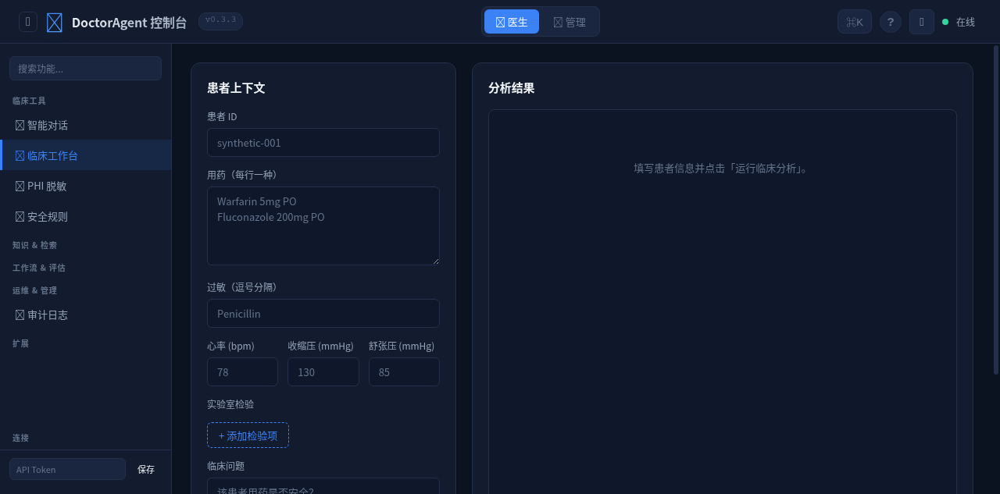
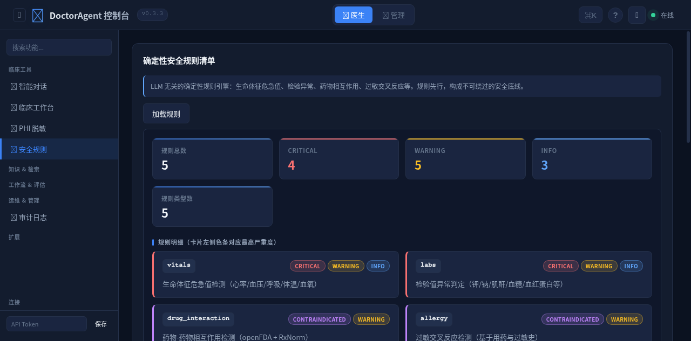
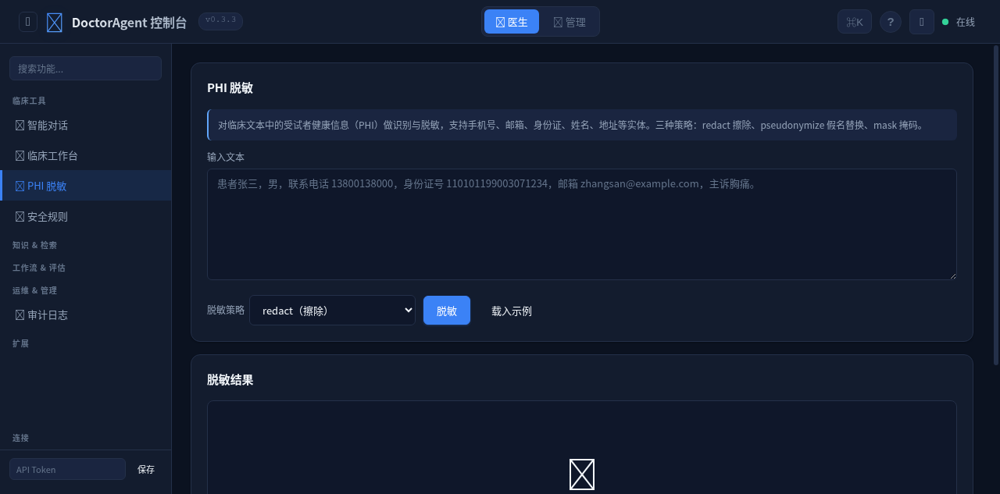
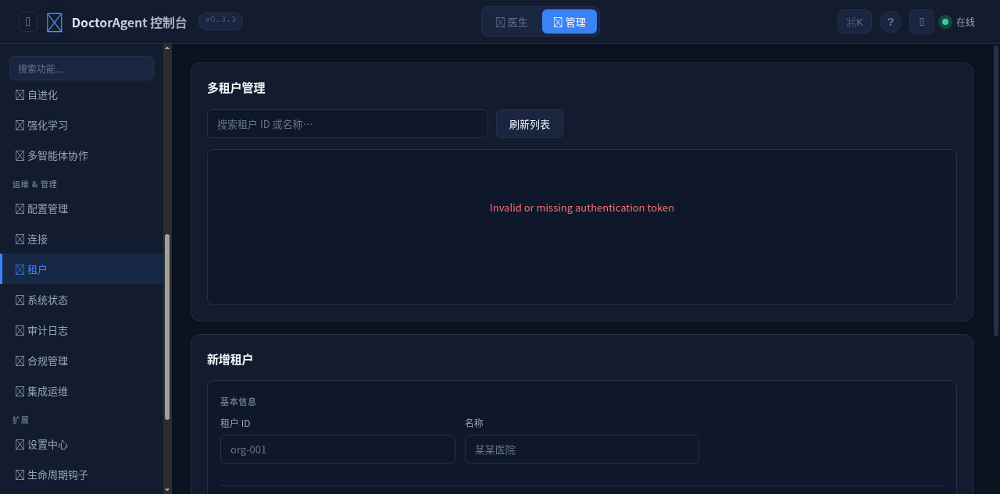
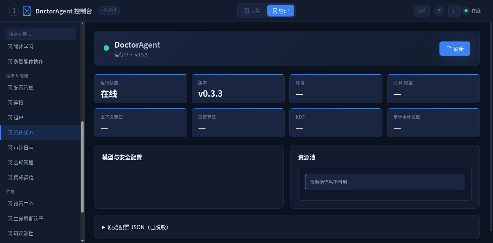

# DoctorAgent

> Clinical AI agent for doctors · 临床 AI 医生智能体 · 臨床AI医師エージェント
>
> Open-source, self-hosted clinical decision support (CDS) agent combining deterministic drug-interaction / critical-value safety rules with multi-agent LLM reasoning — FHIR R4, CDS Hooks 2.0, SMART-on-FHIR, PHI de-identification, RAG document vault, HIPAA-aware audit chain.

[中文](README.zh.md) · [日本語](README.ja.md)

**Keywords**: clinical AI, medical AI, healthcare AI, clinical decision support, CDS Hooks, FHIR R4, SMART-on-FHIR, drug interaction checker, critical value alerting, PHI de-identification, RAG document vault, LangGraph multi-agent, LLM agents, FastAPI, Python, HIPAA, patient safety, self-hosted, on-premise, air-gapped

---

## Table of contents

- [What this is](#what-this-is)
- [Demo](#demo)
- [Why we built it](#why-we-built-it)
- [Architecture in one paragraph](#architecture-in-one-paragraph)
- [Quick start](#quick-start)
- [What you can build on it](#what-you-can-build-on-it)
- [Commercial use](#commercial-use)
- [Compliance status](#compliance-status-current)
- [Test posture](#test-posture)
- [FAQ](#faq)
- [Related projects](#related-projects)
- [License](#license)

---

## What this is

DoctorAgent is a self-hostable AI agent that combines a deterministic safety engine with multi-agent LLM reasoning to help clinicians with medication review, literature search, PHI handling, and documentation.

Three things make it different from the other 47 "medical AI" projects on GitHub:

1. **Safety rules run offline.** Five deterministic checks (critical vitals, lab values, drug-drug interactions, allergy cross-reactivity, duplicate therapy) execute locally without any LLM call. When the rule engine and the LLM disagree, the rule engine wins. Always.
2. **Your data stays on your hardware.** Vault content is encrypted at rest with AES-256-GCM (key derived via PBKDF2-SHA256/Argon2id). Audit log entries are HMAC-SHA256 signed and chained. The server can run air-gapped.
3. **Standards integration is real, not aspirational.** CDS Hooks 2.0 endpoints, FHIR R4 resource handlers, SMART-on-FHIR auth, SNOMED CT / LOINC / ICD-10-CM terminology binding are wired through the code path, not stuck in a roadmap slide.

The current release is v0.3.3, marked as Beta. It's stable enough for pilot deployments but the project is honest about what it isn't: there's no FDA 510(k), no HIPAA certification, no 等保三级 attestation. Those are roadmap goals, written down so you can plan against them.

---

## Demo

[Watch the 40-second walkthrough →](assets/demo/demo.mp4)

Or browse the screenshots below. They're from the actual console running against a local SQLite + Ollama instance — no demo data was faked for the README.

| Clinical workstation | Safety rules engine |
|:---:|:---:|
|  |  |

| PHI de-identification | Multi-tenant management |
|:---:|:---:|
|  |  |

| System dashboard |
|:---:|
|  |

---

## Why we built it

LLM-powered medical assistants are everywhere. Most of them:

- Hallucinate drug doses when the prompt is slightly out of distribution.
- Send patient notes to a third-party API by default with no opt-out.
- Lose their safety reasoning the moment you turn off "creative mode".
- Have a single point of audit (the prompt log) that anyone with shell access can rewrite.

We wanted a system where:

- A clinician can verify "did the model check drug interactions for this patient?" by clicking one button and reading an immutable record.
- An IT admin can point the system at a local Ollama and turn off all outbound traffic.
- A compliance officer can prove what the model saw and decided during a particular encounter on a particular date.

None of that is groundbreaking engineering. It's mostly boring discipline — FHIR resources, HMAC chains, audit logs, role-based access. We did it anyway because the alternatives we tried kept breaking under audit.

---

## Architecture in one paragraph

A FastAPI server hosts both an API and a static console (the single-page web app under `doctoragent/api/static/console`). Inbound clinical documents go through a classifier → an AES-256-GCM encrypted store → a SQLite-backed FTS5 index + a vector index → a retrieval pipeline (HyDE + RRF + cross-encoder rerank) → an LLM agent with a fixed DAG of specialists (病史 → 用药 → 文献 → 文书). Every step writes to an HMAC-chained audit log. A scheduler retries timeouts with priority escalation. UI ships as 27 modules: chat, clinical workspace, PHI tools, vault, RAG, knowledge graph, memory, prompts, DAG, eval, self-evolution, RL, multi-agent collab, config, connections, tenants, system status, audit, compliance, ops, settings, hooks, observability, plugins, A/B experiments, plus two view toggles (clinician vs admin).

The fixed-DAG agent design is non-negotiable for us — once a clinical workflow is compiled, the LLM cannot reroute itself around a safety step. This is what most "agent frameworks" deliberately allow and what we explicitly prevent in the clinical pipeline.

---

## Quick start

You need Python 3.10+ and about 200MB of disk.

```bash
git clone https://github.com/weed33834/DoctorAgent.git
cd DoctorAgent
pip install -e ".[server]"
bash start.sh
```

Then open <http://127.0.0.1:8000/console/> in a browser. No LLM key required for the safety rules engine and the document vault — they work fully offline. Add an Ollama or cloud LLM at `/console/` → "连接" to unlock the agent features.

### Verification that you didn't get a broken checkout

```bash
pytest tests/ -q
```

We expect `2314+ passed`. If the number drops, something broke. Don't ship that build.

---

## What you can build on it

The agent is MIT licensed and explicitly designed to be extended. The hooks system has 15 trigger points (request_received, before_tool_call, after_llm_response, before_audit_write, etc.) where you can attach Python scripts. The plugin manager registers additional entry points at startup.

A few directions people are already exploring in the issue tracker:

- Connecting CDS Hooks to Epic or Cerner (we ship a FHIR R4 adapter; the EHR-side glue is yours)
- Replacing the default LLM with a fine-tuned domain model
- Running the audit chain into an external SIEM (Splunk, Sentinel)
- Replacing SQLite with Postgres for hospital-scale multi-tenant deployments
- Adding SNOMED CT concept lookups to the safety rules engine

PRs that come with tests and a security note get reviewed within a week.

---

## Commercial use

The code is MIT. You can use it inside a hospital, sell it as a hosted service, wrap it in a product, embed it in a larger system — whatever your business model needs. The maintainers offer paid support contracts (response SLA, security review, version pinning) for organizations that need them. Reach out via GitCode issues or the email in `pyproject.toml`.

What we will not accept:

- Selling individual PHI records or model training data derived from them.
- Closed-source forks that don't feed bug fixes back.
- Removing the audit chain or the deterministic safety rules from derivative works.

The last clause is the only one we enforce. Everything else is a community norm.

---

## Compliance status (current)

| Standard | Status | Notes |
|---|---|---|
| HIPAA Safe Harbor (de-identification) | Implemented | PHI de-identification covers the 18 identifier categories. |
| CDS Hooks 2.0 | Implemented | Endpoints exposed at `/cds-services` per spec. |
| FHIR R4 + SMART-on-FHIR | Implemented | Resource handlers in `doctoragent/api/fhir/`. |
| SNOMED CT / LOINC / ICD-10-CM | Implemented | Terminology bindings + lookup helpers. |
| 等保三级 | Roadmap | Q2 2026 target. Self-assessment checklist available on request. |
| HIPAA attestation (third-party) | Not started | Requires production customer with PHI to sponsor. |
| FDA 510(k) / NMPA / CE | Roadmap | Requires a clinical pilot with documented workflow. |
| IRB pre-approval (US) | Not applicable | We don't ship clinical workflows ready for human-subjects research. |

The four "Roadmap" rows are explicit because pretending they're already done wastes your planning cycle.

---

## Test posture

- **2314+ unit tests** pass on Python 3.10, 3.11, 3.12, 3.13.
- **66 API routes** in the console have full round-trip tests.
- **18 CRUD workflows** (clinical workspace, vault, agents, hooks, etc.) are exercised end-to-end.
- **Empty-shell scan** runs as a CI step — if you submit a PR that adds an endpoint or a function which doesn't actually do anything, the test fails.
- **Dependency audit** is part of CI. We pin critical security deps and review transitive upgrades within 48 hours.

---

## FAQ

**Is DoctorAgent free? Can I use it commercially?**
Yes. MIT license, including commercial use, hosted services, and embedding in products. See [Commercial use](#commercial-use) for the three things we won't accept in derivative works.

**Does it work without an LLM?**
The deterministic safety engine (drug interactions, critical values, allergy cross-reactivity, duplicate therapy) and the document vault run fully offline — no API key, no network. The agent / chat features need an LLM backend: any OpenAI-compatible endpoint works, including a local Ollama instance (air-gapped setup is supported).

**Which LLMs can it use?**
Anything exposing an OpenAI-compatible API: Ollama (local), OpenAI, or your own gateway. The connection manager in the console stores multiple providers and lets you switch per session.

**Can it integrate with my EHR?**
DoctorAgent ships CDS Hooks 2.0 endpoints (`/cds-services`) and FHIR R4 resource handlers, plus SMART-on-FHIR authentication. The EHR-side glue (e.g. pointing your EHR's CDS Hooks client at this server) is implementation work, but the protocol side is done.

**How is patient data protected?**
PHI de-identification (HIPAA Safe Harbor, 18 identifier categories, 4 strategies: redact/mask/pseudonymize/hash), AES-256-GCM encryption at rest, HMAC-SHA256 signed audit chain, RBAC + API token + tenant isolation. The vault and audit chain are designed so that nothing sensitive needs to leave your infrastructure.

**Is it certified?**
Not yet. FDA 510(k), HIPAA third-party attestation, and 等保三级 are roadmap items, written down honestly in the [compliance table](#compliance-status-current). Pilot deployments are supported, production regulatory approval is not claimed.

**Where does the project go from here?**
v0.3.x is the current line: expanding the deterministic rule set, Postgres backend for hospital-scale multi-tenant, and SIEM integration for the audit chain. See the issue tracker for the active roadmap.

---

## Related projects

- [badhope/AI](https://gitcode.com/badhope/AI) — Engineering methodology, rule sets and prompt library used by DoctorAgent.
- [badhope](https://gitcode.com/badhope) — 16 other open-source projects.

---

## License

MIT. See `LICENSE`. The included SNOMED CT, LOINC, and ICD-10-CM reference data are redistributed under their respective licenses (see `docs/COMPLIANCE_ROADMAP.md`).

---

> **Clinical use disclaimer**: This system is a clinical decision support tool (CDS). It does not replace physician judgment. All AI-generated suggestions are advisory; final decisions rest with the licensed clinician of record.